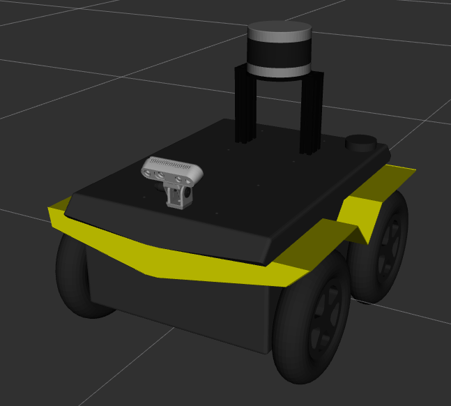

sensor_mounts
===============

This repository contains a collection of generic mounts for cameras, lidars, etc... commonly-used on Clearpath robots.


Usage
---------

The URDF macros contained in this repository are intended to be used with the robot-specific URDF Extras environment
variable.  Create a URDF extras file that adds the necessary payloads, and set the e.g. `JACKAL_URDF_EXTRAS` envar
to refer to the created file.

For example, this file:

```xml
<?xml version="1.0"?>
<robot xmlns:xacro="http://wiki.ros.org/xacro">
  <xacro:include filename="$(find velodyne_mount)/urdf/velodyne_mount_120.urdf.xacro" />
  <xacro:velodyne_mount_120 prefix="main_lidar" parent_link="rear_mount">
    <origin xyz="0 0 0" rpy="0 0 0" />
  </xacro:velodyne_mount_120>

  <xacro:include filename="$(find velodyne_description)/urdf/VLP-16.urdf.xacro"/>
  <xacro:VLP-16 parent="main_lidar_mount_link">
    <origin xyz="0 0 0" rpy="0 0 0" />
  </xacro:VLP-16>

  <xacro:include filename="$(find lockmount_description)/urdf/lockmount.urdf.xacro" />
  <xacro:lockmount prefix="front_camera" parent_link="front_mount" angle="${pi/8}">
    <origin xyz="0.06 0 0" rpy="0 0 0" />
  </xacro:lockmount>

  <xacro:include filename="$(find realsense2_description)/urdf/_d435.urdf.xacro" />
  <xacro:sensor_d435 parent="front_camera_mount_link" name="front_realsense">
    <origin xyz="0 0 0" rpy="0 0 0" />
  </xacro:sensor_d435>
</robot>
```

when used with Jackal will produce this robot model:


