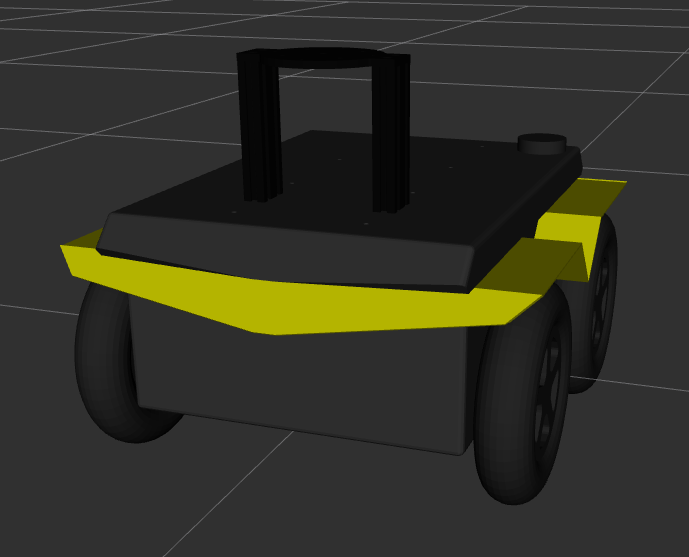

velodyne_mount
=======================

This package contains URDF macros used for mounting VLP16 lidars on Clearpath robots.



To add the mount to your URDF, add e.g.

```xml
<xacro:include filename="$(find velodyne_mount)/urdf/velodyne_mount_120.urdf.xacro" />
<xacro:velodyne_mount_120 prefix="front_lidar" parent_link="front_mount">
  <origin xyz="0 0 0" rpy="0 0 0" />
</xacro:velodyne_mount_120>

<xacro:include filename="$(find velodyne_description)/urdf/VLP-16.urdf.xacro"/>
<xacro:VLP-16 parent="front_lidar_mount_link">
  <origin xyz="0 0 0" rpy="0 0 0" />
</xacro:VLP-16>
```

The `prefix` parameter is prepended to all the joints and links inside the macro to ensure uniqueness.

The `parent_link` parameter defines the parent of the lockmount.  The macro automatically creates a fixed
joint between `parent_link` and `${prefix}_base_link`.

The mounting surface of the mount is `${prefix}_mount_link`, which may be used as the parent link for other URDF joints,
as shown in the example above.
